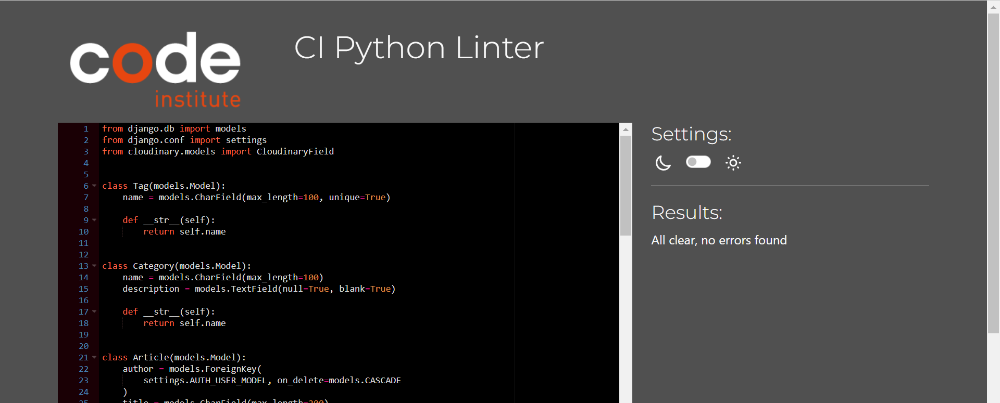
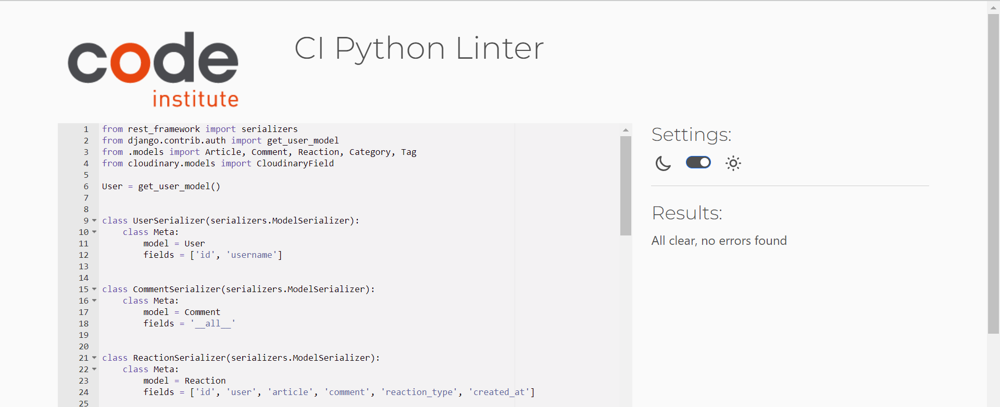
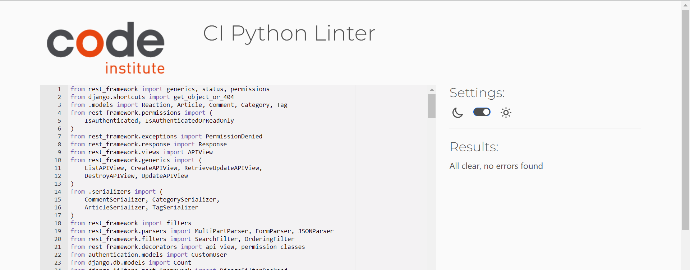
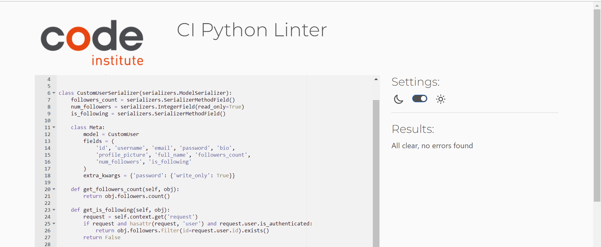
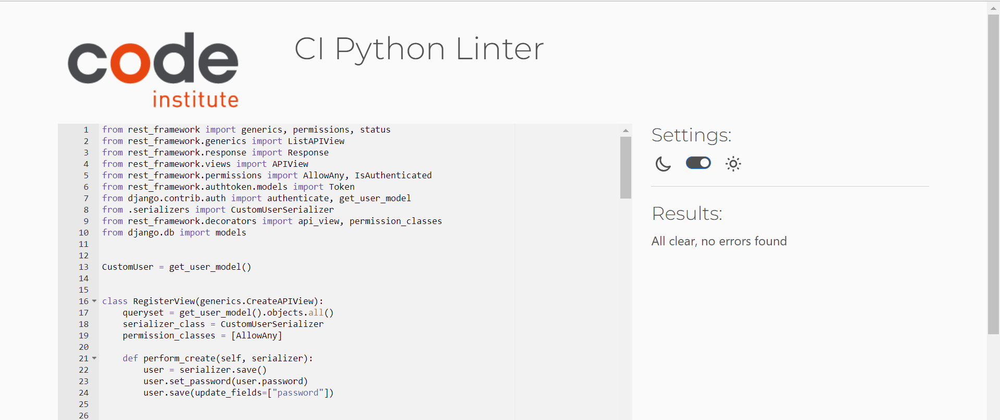

# Global Gazette - Back End

> **Global Gazette** is an innovative community-based publishing platform designed to connect people from diverse backgrounds through open and constructive conversations. It enables users worldwide to create, share, and engage with a wide range of content, including articles, stories, tutorials, and journalistic pieces. Key features of the platform include user authentication, content creation and interaction, advanced content discovery, and dynamic user profiling.

## Deployed Link

- [Global Gazette Back End Deployed Link](https://gg-backend-78d63a43777b.herokuapp.com/)

## Front-End Links

- [Global Gazette Front-End Deployed Link](https://ggazette-4831f7d29d09.herokuapp.com/)
- [Global Gazette Front-End GitHub](https://github.com/FarehaSi/global-gazette-backend)

## Table of Contents

- [Global Gazette - Back End](#global-gazette---back-end)
  - [Deployed Link](#deployed-link)
  - [Front-End Links](#front-end-links)
  - [Table of Contents](#table-of-contents)
  - [User Experience (UX)](#user-experience-ux)
    - [Project Structure](#project-structure)
- [User Stories for Global Gazette](#user-stories-for-global-gazette)
    - [Database Model](#database-model)
  - [Technologies Used](#technologies-used)
    - [Programs Used](#programs-used)
  - [Testing](#testing)
    - [Validation Testing](#validation-testing)
  - [Manual Testing](#manual-testing)
    - [1. User Profile:](#1-user-profile)
    - [2. Articles:](#2-articles)
    - [3. Comments:](#3-comments)
    - [4. Follow and Unfollow:](#4-follow-and-unfollow)
    - [5. Article Likes:](#5-article-likes)
    - [6. Comment Likes:](#6-comment-likes)
    - [7. Authentication:](#7-authentication)
  - [Bugs](#bugs)
  - [Deployment](#deployment)
  - [Credits](#credits)
    - [Code](#code)
    - [Acknowledgement](#acknowledgement)

---

## User Experience (UX)

### Project Structure

The project's fundamental architecture draws inspiration from the [drf-api](https://github.com/Code-Institute-Solutions/drf-api) walkthrough, aligning with industry standards for API implementation. The layout and organization of the serializer, model, and URL files mirror those from the walkthrough, reflecting the conventional and efficient approach of API development in Python using the Django REST Framework. This design choice ensures adherence to established best practices in the field.

User Stories for Global Gazette
===============================

- Authentication

    1. **As a user**, I want to **register with my email and password**, so that **I can create a personal account on Global Gazette.**

        - This is achieved through a registration form that captures email and password, using Django's authentication system for account creation.

    2. **As a user**, I want to **log in to my account**, so that **I can access my personalized settings and interact with the platform.**

        - This is implemented using Django's authentication system, allowing users to securely log in with their credentials.

    3. **As a user**, I want to **log out of my account**, so that **I can ensure my account is secure when I'm not using it.**

        - A logout feature is provided, enabling users to securely exit their session, safeguarding their account.

    4. **As a user**, I want to **reset my password**, so that **I can recover my account access if I forget my password.**

        - Password reset functionality, including email verification, allows users to securely change their password.

    5. **As a user**, I want to **update my profile information**, so that **I can keep my personal information up to date.**

        - Users can update their profile details, such as bio and profile picture, through their account settings.

    6. **As a user**, I want to **see whether I am logged in**, so that **I am aware of my login status and can access features accordingly.**

        - The platform shows the user's logged-in status and provides relevant navigation options based on this status.

    7. **As a user**, I want to **receive confirmation emails upon registration and for important account changes**, so that **I am assured of the security and authenticity of my account activities.**

        - Confirmation emails are sent for account registration and critical updates, ensuring users are informed of significant account activities.

 - Posts

    1. **As a user**, I want to **create new posts**, so that **I can share my thoughts, experiences, and images with the community.**

        - This feature is enabled by a Post model and a user-friendly interface, allowing users to easily create posts with text and images.

    2. **As a user**, I want to **edit my posts**, so that **I can make updates or corrections to my shared content.**

        - An edit function is provided for users to modify their posts, ensuring that they can always keep their content accurate and up-to-date.

    3. **As a user**, I want to **delete my posts**, so that **I can remove content that I no longer wish to share.**

        - Users can delete their posts, giving them control over the content they have shared on the platform.

    4. **As a user**, I want to **view details of posts**, including who created them and when, so that **I can better understand the context and background of the content.**

        - Detailed views for each post are available, displaying information such as the author, creation and edit dates, and other relevant details.

    5. **As a user**, I want to **like and unlike posts**, so that **I can express my appreciation for content and also retract it if I change my mind.**

        - A like/unlike feature is implemented, allowing users to interact with posts by showing or withdrawing their appreciation.

    6. **As a user**, I want to **see the number of likes on posts**, so that **I can gauge the popularity and community engagement of the content.**

        - Each post displays the total count of likes, providing insights into how the community is responding to the content.

    7. **As a user**, I want to **search for posts by keywords or categories**, so that **I can easily find content that interests me.**

        - A search feature is available, enabling users to find posts based on specific keywords or categories.

    8. **As a user**, I want to **filter posts by date, popularity, or category**, so that **I can quickly access posts that align with my interests or current relevance.**

        - Advanced filtering options are provided, allowing users to sort and view posts based on various criteria such as date, popularity, or specific categories.

- Comments

    1. **As a user**, I want to **post comments on articles**, so that **I can engage in discussions and share my opinions or thoughts about the content.**

        - Users are enabled to add comments to articles, fostering a dynamic conversation and community engagement around shared content.

    2. **As a user**, I want to **edit my comments**, so that **I can correct or update my statements in discussions.**

        - An editing feature allows users to make changes to their comments, ensuring that they can revise and keep their contributions relevant and accurate.

    3. **As a user**, I want to **delete my comments**, so that **I can remove my input if I change my mind or find it no longer relevant.**

        - Users have the ability to delete their own comments, providing control over their contributions and maintaining the relevance of the discussion.

    4. **As a user**, I want to **read comments from other users**, so that **I can understand different perspectives and engage with the community.**

        - The platform displays comments from various users, allowing for the exchange of diverse viewpoints and enhancing the communal experience.

    5. **As a user**, I want to **like comments**, so that **I can show appreciation for contributions that I find valuable or insightful.**

        - A feature to like comments is provided, enabling users to express their appreciation for others' contributions.

    6. **As a user**, I want to **reply to comments**, so that **I can directly engage in discussions and contribute to specific threads.**

        - The comment system supports replies, enabling users to respond directly to specific comments and participate in threaded discussions.

    7. **As a user**, I want to **view a threaded structure of comments and replies**, so that **I can easily follow the flow of conversations and understand the context of each discussion.**

        - Comments and replies are presented in a structured, threaded format, making it simple for users to track conversations and understand the relationship between different comments.

### Database Model

- Database model has been created using Lucid Chart.

## Technologies Used

*   [Django](https://www.djangoproject.com/)
*   [Django REST Framework](https://pypi.org/project/djangorestframework/3.14.0/)
*   [Python](https://www.python.org/)
*   [psycopg2](https://pypi.org/project/psycopg2/)
*   [Django all-auth](https://django-allauth.readthedocs.io/en/latest/installation.html)
*   [gunicorn](https://gunicorn.org/)
*   [PostgreSQL](https://www.postgresql.org/)
*   [dj-rest-auth](https://pypi.org/project/dj-rest-auth/2.2.5/)
*   [Django-filter](https://pypi.org/project/django-filter/22.1/)
*   [Djangorestframework-simplejwt](https://pypi.org/project/djangorestframework-simplejwt/5.2.1/)
*   [Django-cors-headers](https://pypi.org/project/django-cors-headers/3.13.0/)
*   [Cloudinary](https://cloudinary.com/) (for image hosting)

### Programs Used

1. [Git](https://git-scm.com/)

   - Git was used by utilizing the Gitpod terminal to commit to Git and Push to GitHub. Version control.

2. [GitHub](https://github.com/)

   - GitHub was used to store the project code after being pushed in by Git. Project repository linked with Heroku for the deployment process. GitHub was also used to create the kanban board.

3. [Heroku](https://dashboard.heroku.com/login)

   - Heroku was used to deploy this project.

4. [Lucid Chart](https://www.lucidchart.com/)

   - Lucid Chart was used to create the data model for the back end.

5. [CI Python Linter](https://pep8ci.herokuapp.com/)

   - CI Python Linter was used to validate the Python code used and check for warnings/errors.

6. [Cloudinary](https://cloudinary.com/)

   - Cloudinary is used to host the uploaded images.

7. [Autopep8](https://pypi.org/project/autopep8/)

   - Autopep8 was used to help organize Python code to match PEP8 standards.

8. Beautify

   - Beautify Command Palette on Git was used to organize the code in all files.

9. [ElephantSQL](https://www.elephantsql.com/)

   - ElephantSQL was used for the configured and optimized PostgreSQL database.

10. [Pillow](https://pypi.org/project/Pillow/9.2.0/)
    - Python Imaging Library which provides image processing capabilities.

## Testing

### Validation Testing

- Following files have been run through CI Python Linter and all files returned no issues.
Screenshot of articles models.py 
  
Screenshot of articles serializers.py 
  
Screenshot of articles views.py 
  
Screenshot of user authentication serializers.py 
  
Screenshot of user authentication views.py 

Manual Testing
--------------

Extensive manual testing has been conducted on the backend of the project to ensure reliability and functionality. Each feature has been rigorously tested multiple times to confirm its successful operation. The testing process involved repeatedly interacting with each feature to validate its correctness and efficiency.

### 1\. User Profile:

The user profile functionality in the application provides a comprehensive and interactive user experience. Here are the key features and outcomes from the manual testing:

*   **Account and User Profile Creation**: Users can successfully create an account. Upon account creation, their profile is automatically generated with default images and content, which are stored in the database.
*   **User Profile Viewing**: Users have the ability to view their profiles, including details such as username, profile image, content, and account creation date.
*   **Dynamic Counts Display**: The profile interface displays dynamic counts for posts, followers, and following. These counts update in real-time, increasing with new posts or new followers, and decreasing when posts are deleted or users are unfollowed.
*   **User List and Detailed Views**: A list of users can be viewed under the 'list view'. Detailed information about each user can be accessed by appending the specific user ID to the URL.
*   **Editable User Profiles**: Users can view other users' profiles but have editing privileges only on their own profiles. This ensures user privacy and account security.
*   **User Profile Deletion**: Users have the option to delete their profiles through the backend, allowing for account management and data control.
*   **Functional URLs**: All profile-related URLs function correctly. The general profile list can be accessed via `/auth/users/<int:id>/`, and detailed views of individual profiles are available through specific profile IDs.

Here are some visual insights into the profile features:

Screenshot of Public User Profile 
  
Screenshot of Owner's Profile Details with Edit Functionality 
  
Screenshot of Another User's Profile Details (Read-Only) 

### 2\. Articles:

The article functionality in the application provides users with the ability to interact with content in various ways. The following are the outcomes of manual testing conducted on this feature:

*   **Article Creation**: Users can successfully create articles. Each created article is stored in the database with all provided details such as title, content, tags, and category.
*   **Viewing Articles**: Users can view a list of all articles and access detailed views of individual articles, including their title, content, author, and associated comments.
*   **Editing and Deleting Articles**: Article authors have the ability to edit or delete their articles. This ensures that users have full control over the content they publish.
*   **Interactions with Articles**: Users can interact with articles through likes and comments. These interactions are reflected in real-time, showcasing community engagement with the content.
*   **Search and Filter Functionality**: Users can search for articles based on titles, content, or author usernames. Additionally, articles can be filtered by categories or tags, enhancing the user experience in finding relevant content.
*   **Responsive Design**: The article functionality is designed to be responsive, ensuring a seamless experience across different devices and screen sizes.

Visual examples of article interactions:

Screenshot of Article List View 
  
Screenshot of Detailed Article View  
 Screenshot of Article Edit Function   
 Screenshot of Article Search and Filter Functionality 

### 3\. Comments:

Comments play a crucial role in enhancing user interaction within the application. The following points outline the results from manual testing of the comment features:

*   **Comment Posting**: Users can successfully post comments on articles. These comments are stored in the database and are visible under the respective articles.
*   **Viewing Comments**: Users can view all comments associated with an article. This feature allows for a dynamic discussion and exchange of ideas related to the article content.
*   **Editing and Deleting Comments**: Users have the ability to edit or delete their own comments, providing them with control over their contributions to discussions.
*   **Reply to Comments**: Users can reply to existing comments, enabling threaded discussions and more in-depth conversations on the articles.
*   **Like/Dislike Functionality**: Users can express their opinions on comments by liking or disliking them. This feature encourages more engagement and interaction among users.
*   **Real-time Update**: The comment count and reactions are updated in real-time, reflecting the active participation of users in discussions.

Visual evidence of comment functionalities:

Screenshot of Comments under an Article   Screenshot of Adding a New Comment   Screenshot of Editing a Comment   Screenshot of Comment Like/Dislike Feature 

### 4\. Follow and Unfollow:

The follow and unfollow functionalities are integral to the social aspect of the application. They allow users to connect with others and curate their content feed. Here's how these features fared in manual testing:

*   **Follow Functionality**: Users can successfully follow other users. This action is immediately reflected in both users' profiles, with an increase in the follower count for the followed user and an increase in the following count for the user who initiated the follow.
*   **Unfollow Functionality**: Users can unfollow users they are currently following. This action leads to a decrement in the follower count of the unfollowed user and the following count of the user performing the unfollow action.
*   **Profile Updates**: The user's profile is updated in real-time to reflect the changes in the follower and following counts post follow or unfollow actions.
*   **Access Control**: Users cannot follow themselves, ensuring logical integrity in the application's social structure.
*   **Backend Validation**: Proper validations are in place to handle scenarios where a user tries to follow an already followed user or unfollow a user not in their following list.

Visual evidence of follow and unfollow functionalities:

Screenshot of User Profile with Follow Option   
Screenshot of Updated Follower/Following Count   
Screenshot of Unfollow Option in Action   
Screenshot of Backend Validation for Follow/Unfollow 

### 5\. Article Likes:

Article likes are a key feature allowing users to express their appreciation for content. The following points were covered in the manual testing of article likes:

*   **Liking Articles**: Users can successfully like other users' articles. The like action is immediately registered in the API, associating the like with the specific article.
*   **Unliking Articles**: Users can retract their likes from articles. Upon unliking, the like is removed from the article, reflecting accurately in the database.
*   **Restriction on Self-Likes**: Users are prevented from liking their own articles. Any attempt to do so results in a 'permission denied' error, maintaining the authenticity of likes.
*   **Duplicate Like Prevention**: The system prevents users from liking the same article multiple times. If a user tries to like an already liked article, a 'duplicate like' error message is shown.
*   **URL Functionality**: All relevant URLs function as expected. Users can view all article likes at a dedicated endpoint and access details of specific likes by appending the like's ID to the URL.

Visual documentation of the article like feature:

Screenshot of Article Likes List  
Screenshot of Specific Article Like Detail   
Screenshot of Error on Liking Own Article   
Screenshot of Duplicate Like Error Message 

### 6\. Comment Likes:

Comment likes are an integral feature, allowing users to show appreciation for others' opinions and interactions. The manual testing of comment likes encompassed the following aspects:

*   **Liking Comments**: Users can successfully like comments made by other users. This action updates the like count on the comment and is promptly reflected in the API.
*   **Unliking Comments**: Users have the ability to unlike comments. This action decreases the like count on the comment, and the change is instantly updated in the database.
*   **Restriction Against Self-Liking**: The system prohibits users from liking their own comments. Attempts to do so result in a 'permission denied' error, maintaining integrity in user interactions.
*   **Prevention of Duplicate Likes**: Users are restricted from liking a comment more than once. If a user tries to like an already liked comment, the system responds with a 'duplicate like' error message.
*   **URL Functionality**: All URLs related to comment likes function correctly. Users can navigate to a list of all comment likes and view detailed information about specific likes using their unique IDs.

Visual proof and documentation of the comment like feature:

Screenshot of Comment Likes List   Screenshot of Individual Comment Like Detail   Screenshot of Error when Liking Own Comment   Screenshot of Duplicate Like Error on Comment 

### 7\. Authentication:

Authentication is a critical feature of the application, ensuring secure access and user-specific functionalities. The manual testing of the authentication process encompassed various scenarios:

*   **User Registration**: Users can register successfully with their chosen credentials. The system validates the information and creates a new user profile, which is verified in the database.
*   **User Login**: Upon successful registration, users can log in with their credentials. The system authenticates the details and grants access, providing a token for session management.
*   **Profile Access**: Authenticated users can access and edit their profiles. Unauthorized or unauthenticated access attempts to other users' profiles are denied, ensuring privacy and security.
*   **Password Encryption**: User passwords are encrypted and securely stored. The testing confirmed that plain text passwords are not visible or accessible in the database.
*   **Token Generation**: Upon logging in, users receive an authentication token, unique to their session. This token is required for performing certain actions and accessing restricted endpoints.
*   **Logout Functionality**: Users can log out effectively, invalidating the current session token. This prevents further actions under the user's profile until they log in again.

Illustrations and proof of the authentication features:

Bugs
----

Throughout the development of this project, several challenges and bugs were encountered. These issues provided valuable learning opportunities and were resolved through research and community support.

*   **(1) Issue:** Encountered an 'Access Denied' error when attempting to edit or delete articles as a logged-in user.  
    **Fix:** The issue was traced back to permission settings in the views. Adjusting the permissions and implementing custom permission classes resolved the issue, ensuring that users could only edit or delete their own articles.
*   **(2) Issue:** Users were receiving 'Server Error 500' when trying to follow or unfollow other users.  
    **Fix:** This was due to a logical error in the follow/unfollow views. Refactoring the code to correctly handle the user relationships and ensuring proper error handling fixed the issue.  
    Screenshot of Follow/Unfollow Error  
*   **(3) Issue:** Received 'FieldError' when trying to filter articles based on categories and tags.  
    **Fix:** The problem was caused by incorrect field names in the filter backends. Updating the field names to match the model fields in the articles views resolved the filtering issue.  
    Screenshot of FieldError  
*   **(4) Issue:** Experienced 'TypeError' during serialization of user profiles.  
    **Fix:** This was resolved by modifying the user serializer to handle the data types correctly, particularly for the profile picture field where the error was occurring.  
    Screenshot of TypeError  
*   **(5) Issue:** Encountered 'InternalServerError' during comment creation.  
    **Fix:** The error was traced back to the comment model's save method. Implementing proper exception handling and revising the logic for updating the comment count on articles resolved this issue.  
    Screenshot of InternalServerError  

These experiences underscored the importance of thorough testing and the value of community resources like Stack Overflow and development forums in troubleshooting and problem-solving.

## Deployment

- The following steps were taken for the deployment process for the back end component of Childhood Memories. These steps take place after Django is correctly installed and an 'env.py' file is made (and file is added to .gitignore). [Cloudinary](https://cloudinary.com/) must also be successfully hooked up to Django by adding in all necessary imports and settings in 'settings.py' and 'env.py'.
  Instructions are copied from CI's DRF Example Project.

1. Login or create an account to [ElephantSQL](https://www.elephantsql.com/) and click "Create New Instance".
2. Set up a plan, give your plan a name (name of project), select the Tiny Turtle (free plan), leave the Tag fields blank, and select your region.
3. Click review, and after ensuring details are correct, click 'Create instance'.
4. Return to ElephantSQL dashboard and click database instance name for this project.
5. In URL section, click the copy icon to copy database URL.
6. Log in to [Heroku](https://www.heroku.com/).
7. Create a new app, add a unique app name (this project is called "Childhood memories") and choose your region, and create app.
8. Open the settings tab of your project, Add a Config Var 'DATABASE_URL' and for the value, copy in the database URL from ElephantSQL (without quotation marks).
9. In terminal of your project, run `pip3 install dj_database_url==0.5.0 psycopg2`.
10. In 'settings.py' file of project, add `import dj_database_url` underneath `import os`.
11. In 'settings.py', update the DATABASES section to the following:
    
12. In your 'env.py' file, add a new environment variable to Gitpod with the key set to `DATABASE_URL` and the value to your ElephantSQL database URL.
13. Temporarily comment out the DEV environment variable so Gitpod can connect to external database.
14. Back in 'settings.py', add print statement to confirm you are connected do database.
15. In terminal do a dry run to makemigrations to confirm you are connected to the database. If you see the 'connected' message printed in terminal, remove print statement.
16. Migrate your database models running `python3 manage.py migrate`.
17. In terminal of Gitpod workspace, install gunicorn by running `pip3 install gunicorn django-cors-headers`.
18. Update your requirements.txt by running `pip3 freeze --local > requirements.txt`.
19. Create a Procfile by running `touch Procfile`.
20. Inside Procfile, add:
    `release: python manage.py makemigrations && python manage.py migrate`
    `web: gunicorn childhood_memories_drf_api.wsgi`
21. In 'settings.py', update value of ALLOWED_HOSTS variable to include Heroku app's URL.
22. Add corsheaders to INSTALLED_APPS of 'settings.py'.
23. Add corsheaders middlewear to the TOP of MIDDLEWARE.
24. Under MIDDLEWARE list, set the ALLOWED_ORIGINS for network requests to be made to the server with following code:
    

    

25. To have front-end app and API deployed to different platforms, set JWT_AUTH_SAMESITE atribute to 'None' like so:
    
26. Remove the SECRET_KEY value and replace the following code to use an environment variable instead.
27. Set a new value for SECRET_KEY in env.py (do not use the same published to GitHub in commits).
28. Set the DEBUG value to True only if DEV environment variable exists. This will mean it's True in development, and False in production.
29. Comment DEV back in 'env.py'.
30. Ensure 'requirements.txt' file is up to date by running `pip3 freeze --local > requirements.txt`.
31. Add, commit, and push your code to GitHub.
32. Back on Heroku dashboard, open your app and open settings tab.
33. Add two more Config vars, SECRET_KEY (same value as the one in env.py file) and CLOUDINARY_URL (copy in Cloudinary URL from env.py file without quotation marks).
34. Open the Deploy tab.
35. In Deployment method section, select 'Connect to GitHub', search for your repo, and click Connect.
Credits
-------

### Code

*   **[Code Institute DRF API Example Project](https://github.com/Code-Institute-Solutions/drf-api)**: The foundation of this API was built using Django REST Framework, with inspiration from the Code Institute's DRF API example project. This project influenced the database model, the various features and functionality of the API, including creating serializers, setting up filters, and search fields. It provided an excellent foundation to build upon and customize for the specific needs of this application.
*   **[Django REST Framework Documentation](https://www.django-rest-framework.org/)**: The official documentation of Django REST Framework was an invaluable resource throughout the development of this project. It was frequently consulted for guidance on implementing various features and best practices.

### Acknowledgement

*   Code Institute tutors: For their invaluable help and guidance with various technical issues encountered during the development of this project.
*   Stack Overflow: For being an indispensable resource providing solutions, tips, and tricks that greatly assisted in resolving errors and improving the code.